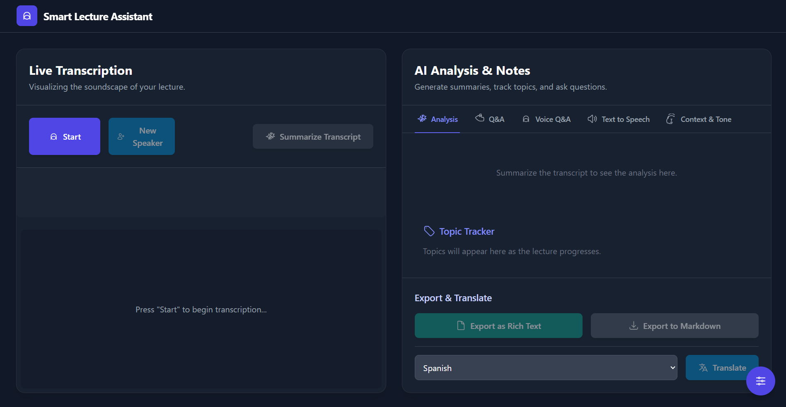

# Smart Lecture Assistant

<div align="center">

</div>


> A lightweight web app to assist lectures using real-time speech recognition, live transcripts, summaries, voice Q&A, and accessibility features.

This repository was created for GK Hacks 2025. It demonstrates an interactive frontend built with TypeScript and Vite that integrates on-device or cloud speech services to provide live lecture assistive features.

## Key features
- Real-time speech recognition and single-utterance capture
- Live transcript display with topic tracking
- Automated summaries of lecture segments
- Voice-driven Q&A panel (ask follow-up questions about recent speech)
- Text-to-speech playback and audio visualization
- Export transcripts and session data
- Accessibility panel for adjusted presentation and controls

## Project structure (important files)
- `App.tsx`, `index.tsx`, `index.html` — app entry points
- `components/` — UI pieces (TranscriptDisplay, QAPanel, TopicTracker, TextToSpeechPanel, ControlPanel, AccessibilityPanel, etc.)
- `hooks/` — custom hooks for speech recognition (`useSpeechRecognition.ts`, `useSingleUtteranceRecognition.ts`)
- `services/geminiService.ts` — wrapper to call Gemini / LLM services (set API key in env)
- `utils/formatter.ts` — small helpers for formatting output
- `types.ts` — shared TypeScript types

## Tech stack
- Frontend: React + TypeScript
- Bundler/dev server: Vite
- Speech: Browser Web Speech / custom hooks (plus optional Gemini/Large Model calls for summarization and QA)

## Quick start (Windows PowerShell)

Prerequisites:
- Node.js (recommend v18+)

1) Install dependencies

```powershell
npm install
```

2) Create an environment file

If your project uses a Gemini (or LLM) API key for summarization/Q&A, create a `.env.local` file in the project root and add:

```text
GEMINI_API_KEY=your_api_key_here
# If your app expects VITE-prefixed vars, follow that convention (e.g. VITE_GEMINI_API_KEY)
```

3) Run the dev server

```powershell
npm run dev
```

Open the app at the address Vite prints (typically http://localhost:5173 or http://localhost:3000).

## Development notes
- The UI is componentized under `components/`. To add a feature, add or extend a component and update `App.tsx` to wire props/state.
- Speech recognition logic lives in `hooks/`. `useSingleUtteranceRecognition.ts` is suitable for short-turn capture; `useSpeechRecognition.ts` handles continuous transcripts.
- `services/geminiService.ts` contains the code path to call the LLM for summarization and QA. Keep API keys out of source control.

## Environment & secrets
- Never commit secret keys. Use `.env.local` and add it to `.gitignore` (if not already).

## Testing & linting
- This repository doesn't include a test harness by default. Consider adding a small test suite (Jest/Playwright) for critical flows (speech hook, transcript formatting).

## Contribution
If you'd like to contribute, open an issue or a PR with a short description of your change. Keep changes focused and add small tests when possible.

## License
There is no license.

---

If you'd like, I can also:
- add a `.env.local.example` file with var names,
- add a short CONTRIBUTING.md with PR guidelines,
- or add a minimal `npm run build` + `preview` instructions to the README.

Contact / maintainers: check the repo owner on GitHub.
